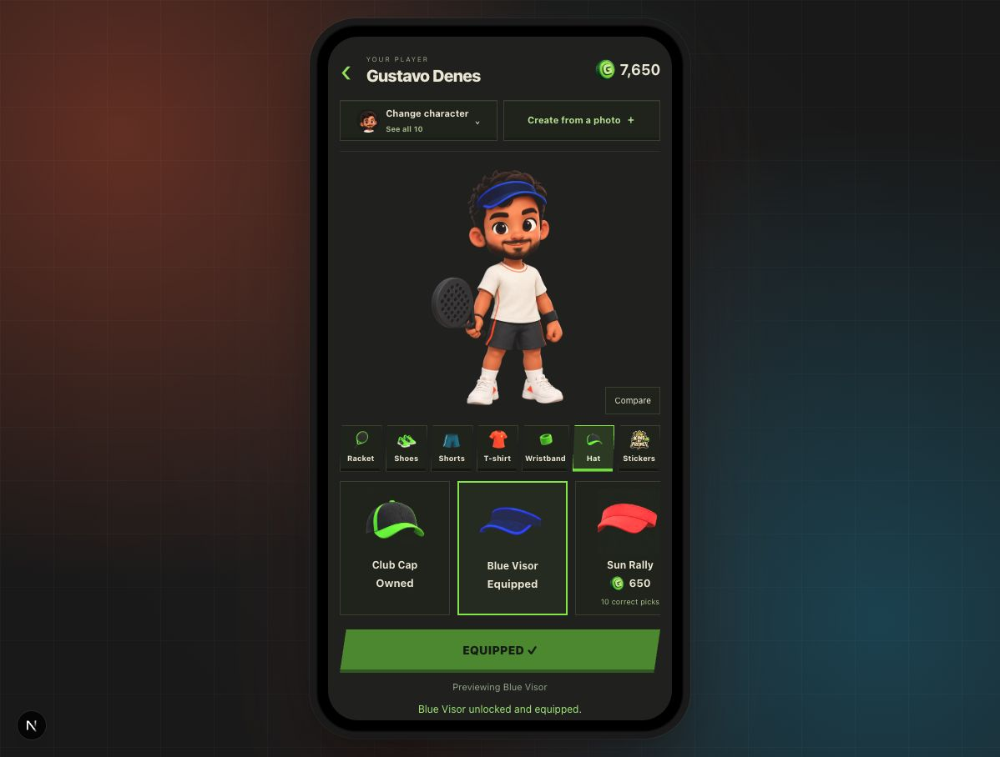
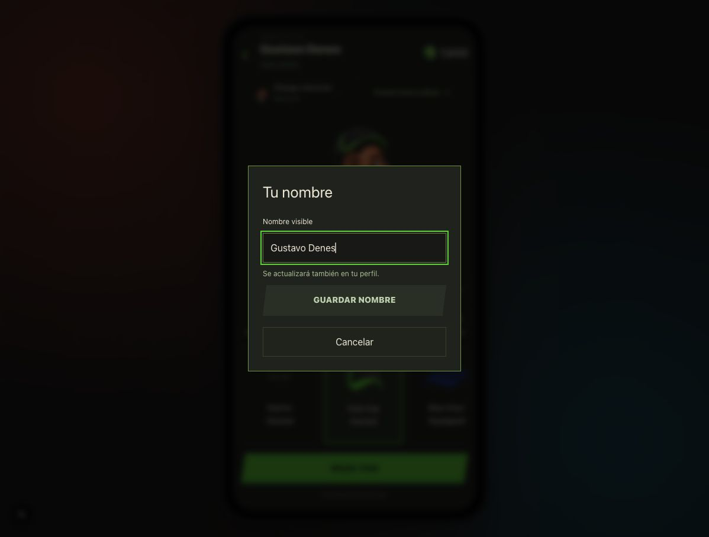
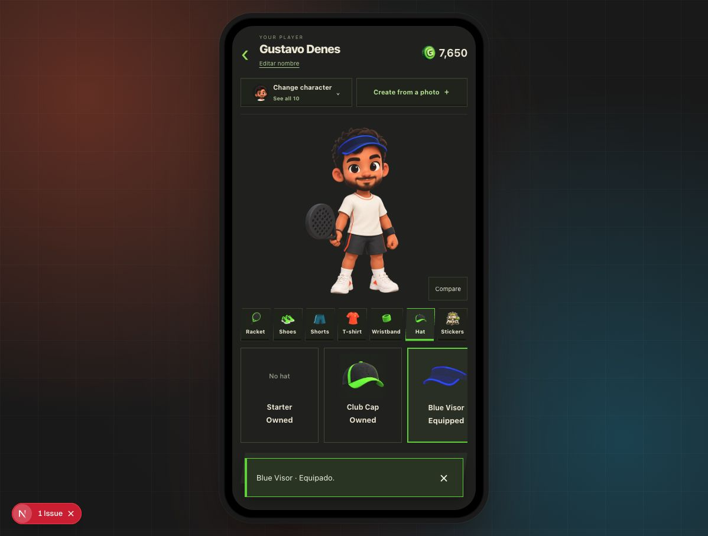

# Avatar shop review — 28 September 2026

Scope: local avatar shop, desktop browser with mobile app shell. No production changes.

## 1. Browse and try on — improved, some polish remains

The avatar is the clear focal point and owned/equipped states are explicit. However, the name had no edit affordance, the page used English labels on the Spanish route, tiny category labels were hard to scan, and multiple dark surface colors revealed artwork edges. Success copy appeared below the primary action where it was easy to miss.

Changes: consistent neutral surfaces and brand green; stable background during animation; clearer disabled state; larger compare target; short try-on transitions respecting reduced motion. Images retain their original source backgrounds, so this is rendering cleanup, not true alpha extraction. Transparent source assets remain the robust long-term solution. Localization of the older shop labels remains outstanding.

## 2. Edit name — clear entry and working form; live save not exercised

Added Edit name beneath the existing display name. Native modal with labelled input, focus handling, 40-character limit, disabled unchanged/empty saves, loading and inline failure states. Uses existing PATCH /api/user/profile and refreshes the canonical profile after success. Open and cancel verified; the user's real name was not changed during QA.

## 3. Equip and buy feedback — improved and equip verified

Success feedback now appears in a dismissible, screen-reader-announced toast, including purchase-and-equip success. Brief preview and dialog animations respect reduced motion. Equip was exercised and the original Blue Visor restored; no Guacas were spent. Purchase/inventory logic: six tests passed. New purchase toast was code reviewed but not exercised by buying an item in the user's saved inventory.

## Remaining risks
- The shop still uses local browser balance/inventory and a fixed zero win count. Connect real wallet, inventory, and performance before production commerce.
- Old English shop labels need translation through the app's message system.
- Tiny category labels and milestone copy merit testing on an actual small phone and with larger text.
- Did not certify accessibility, test screen readers, verify all character/item combinations, or submit a real name change.
- A development hot-refresh stylesheet warning appeared during edits; no application error was reported in the checked console entries.
