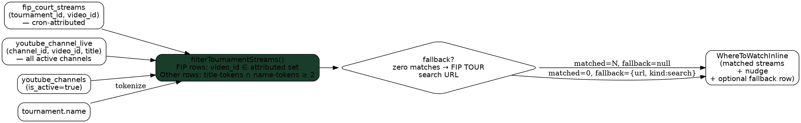

# Tournament-scoped "Where to Watch" filter

**Date:** 2026-05-22
**Status:** Approved, ready for implementation plan
**Scope:** FIP-tier tournament detail pages — `/[locale]/tournaments/[id]`

## Problem

The "Dónde Ver" panel on the tournament Overview tab (`WhereToWatchInline`) is fed by `youtube_channel_live` filtered **only by channel abbreviation** ([tournaments/[id]/page.tsx:1440](src/app/[locale]/(app)/tournaments/[id]/page.tsx:1440)). For an FIP-tier tournament page this surfaces every live FIP TOUR video — including videos from other tournaments running in parallel.

Concrete example: on the **FIP Bronze Marnes** page, the panel currently lists the Marnes Round of 16 stream *plus* four "FIP BRONZE YOGYAKARTA — Round of 32 — Court N" streams. The four Yogyakarta rows are misleading on a Marnes page.

The per-match "Where to Watch" affordance (`WhereToWatchBanner`, fed by [resolveStreamsForMatches](src/lib/fip-stream-resolver.ts:118)) is already tournament-scoped via `fip_court_streams.tournament_id`. The panel-level query just hasn't been wired to the same attribution.

## Goal

Filter the tournament-page panel so only streams attributable to *this* tournament appear, and broaden lookup beyond FIP TOUR to include all active channels from the ops **YT Channels** tab — while keeping FIP TOUR canonical and the only source for a search fallback.

## Decisions

1. **Multi-channel lookup.** Pull live videos from every `youtube_channels` row with `is_active = true`, not just the tier-mapped abbreviation. The YT Channels ops tab is the source of truth.
2. **Per-channel attribution rule, mirroring the per-match resolver's hierarchy:**
   - **FIP TOUR (canonical):** a live video belongs to this tournament iff its `video_id` appears in `fip_court_streams` with `tournament_id = thisTournament.id`. This is what the [fip-streams-discover](src/app/api/cron/fip-streams-discover/route.ts) cron writes after parsing titles via [parseFipStreamTitle](src/lib/fip-stream-title-parser.ts).
   - **Other channels (heuristic):** a live video belongs to this tournament iff its title shares **≥2 non-noise tokens** with the tournament name, using the same tokenizer as the FIP title parser. Two tokens prevents "padel" or "fip" alone from triggering.
3. **Silent drop for empty non-canonical channels.** If a non-FIP channel has zero matched streams for this tournament, its block does **not** render at all. No "Search this channel" row.
4. **FIP-TOUR-only fallback.** When **no channel** has any matched stream, render exactly one fallback row: the FIP TOUR tournament-scoped channel-search URL — same shape as Tier-3 in [fip-stream-resolver.ts:47](src/lib/fip-stream-resolver.ts:47) (`youtube.com/@<FIP_CHANNEL_HANDLE>/search?query=<tournament name>`).
5. **Status nudge.** Below the eyebrow, a small tinted strip:
   - **Green** when ≥1 channel matched — copy: *"Mostrando transmisiones identificadas para este torneo"*.
   - **Amber** when fallback row is shown — copy: *"Aún no identificamos transmisiones para este torneo"*.

## Out of scope

- The matches-page popup (`WhereToWatchPopup`) keeps its current channel-level behaviour — multi-tournament leakage isn't a problem there.
- The per-match `WhereToWatchBanner` is already attribution-scoped — unchanged.
- Premier-tier tournament pages keep current behaviour. PP tournaments rarely overlap, and PP has no canonical per-tournament attribution table yet. The filter logic is designed to extend to PP later via the same heuristic, but Premier wiring is deferred.
- No new YouTube quota cost. We're only reading what discovery already collected.

## Architecture

### Data flow



### New / changed files

| File | Change |
|---|---|
| `src/lib/fip-stream-title-parser.ts` | Export the existing private `tokenize()` function (and `NOISE_TOKENS`) for reuse. No logic change. |
| `src/lib/where-to-watch/filter-tournament-streams.ts` | **New.** Pure function. Inputs: `liveVideos[]`, `attributedVideoIds: Set<string>`, `tournamentNameTokens: string[]`. Output: filtered `LiveChannel[]`. No I/O. |
| `src/lib/where-to-watch/filter-tournament-streams.test.ts` | **New.** Unit tests: FIP-attributed pass-through, FIP-unattributed reject, non-FIP token-overlap pass with ≥2 tokens, non-FIP reject with 0/1 tokens, empty inputs. |
| `src/components/where-to-watch/WhereToWatchInline.tsx` | New optional prop `fallback?: { url: string; tournamentName: string } \| null`. When present, render amber nudge + single fallback row instead of channel blocks. When absent and `groups.length > 0`, render green nudge above blocks. When both absent, self-hide (existing behaviour). |
| `src/app/[locale]/(app)/tournaments/[id]/page.tsx` | Replace the abbreviation-filtered queries with: fetch live videos across all active channels, fetch `fip_court_streams.video_ids` for `tournament_id`, call `filterTournamentStreams`, compute fallback if empty. Pass new `fallback` prop. |
| `src/messages/{en,es,pt,it,fr}.json` | Add `whereToWatch.tournamentMatchedNudge`, `whereToWatch.tournamentEmptyNudge`, `whereToWatch.searchFallbackLabel`, `whereToWatch.searchFallbackButton`. |

### Component contract — `WhereToWatchInline` after changes

```ts
export interface WhereToWatchInlineProps {
  liveChannels: LiveChannel[]      // already filtered to this tournament
  broadcasters: BroadcasterRow[]
  channelsMeta?: ChannelMeta[]
  todayCircuits: string[]
  geoCountry: string | null
  // NEW — rendered when the filter produced zero matches.
  fallback?: { url: string; tournamentName: string } | null
}
```

Filtering happens **upstream** (page-level). The component just renders. `buildGroups` is reused unchanged — it operates on the already-filtered inputs.

### Filter function — `filterTournamentStreams`

```ts
export interface LiveVideoForFilter {
  videoId: string
  title: string
  channel: { id: string; abbreviation: string; /* …meta */ }
}

export function filterTournamentStreams(args: {
  liveVideos: LiveVideoForFilter[]
  attributedVideoIds: Set<string>     // from fip_court_streams for this tournament
  tournamentNameTokens: string[]      // tokenize(tournament.name)
  minHeuristicTokens?: number         // default 2
}): LiveVideoForFilter[]
```

Rules:
- If `video.channel.abbreviation === 'FIP'`: keep iff `attributedVideoIds.has(video.videoId)`.
- Else: tokenize `video.title` with the FIP parser's tokenizer; keep iff intersection size with `tournamentNameTokens` ≥ `minHeuristicTokens` (default 2).
- Token comparison is case-folded, diacritic-stripped, noise-filtered — all handled by the shared `tokenize()` helper.

### Page-level query changes

In the existing `useEffect` at [tournaments/[id]/page.tsx:1405](src/app/[locale]/(app)/tournaments/[id]/page.tsx:1405):

**Before:**
- `youtube_channel_live` filtered `.eq('channel.abbreviation', tournamentChannelAbbr)`
- `youtube_channels` filtered `.eq('abbreviation', tournamentChannelAbbr)`

**After:**
- `youtube_channel_live` selects all rows where `channel.is_active=true` (no abbreviation filter).
- `youtube_channels` selects all rows where `is_active=true`.
- **New** parallel query: `fip_court_streams.select('youtube_video_id').eq('tournament_id', tournament.id)` → `attributedVideoIds: Set<string>`.
- After all four promises resolve, call `filterTournamentStreams` to produce the filtered `liveChannels` and `channelsMeta`.
- If filtered `liveChannels.length === 0` → compute `fallback = { url: tournamentSearchUrl(tournament.name), tournamentName: tournament.name }` (reuse [fip-stream-resolver.ts:47](src/lib/fip-stream-resolver.ts:47)'s `tournamentSearchUrl` — export it).
- If filtered `liveChannels.length > 0` → `fallback = null`.

### Render rules in `WhereToWatchInline`

- `liveChannels.length > 0` (any group) → green nudge + channel blocks (current rendering).
- `liveChannels.length === 0` and `fallback != null` → amber nudge + single FIP TOUR fallback row (channel avatar + tournament-scoped search button).
- `liveChannels.length === 0` and `fallback == null` → component returns `null` (preserves existing self-hide behaviour for non-FIP tournaments where the upstream chose not to render a fallback).

### i18n keys

```json
{
  "whereToWatch": {
    "tournamentMatchedNudge": "Mostrando transmisiones identificadas para este torneo",
    "tournamentEmptyNudge": "Aún no identificamos transmisiones para este torneo",
    "searchFallbackLabel": "Buscar \"{tournament}\" en FIP TOUR",
    "searchFallbackButton": "Buscar"
  }
}
```

Five locales (EN/ES/PT/IT/FR). Spanish copy from the mockup is the reference; translations should preserve the "identified" framing (it's an attribution claim, not a guarantee of all available streams).

## Edge cases

| Case | Behaviour |
|---|---|
| Discovery cron lag (<15 min) — new FIP stream not yet in `fip_court_streams` | Not shown on FIP TOUR block; will appear after next discovery run. Acceptable. |
| Title parser fails — stream lands in `fip_streams_unresolved` | Never shown on FIP TOUR block. Acceptable (ops can manually resolve). |
| Two-token heuristic false positive (e.g., a non-Marnes stream that happens to share "marnes" + "round" tokens) | Possible. Mitigated by noise-token list. Real failure rate is empirically low based on existing parser data. |
| Non-FIP tournament page (Premier-tier) | Filter still runs. FIP-canonical branch never fires (no `fip_court_streams` rows for PP tournaments). Other channels match by heuristic. Fallback is FIP-TOUR-only by design — for a Premier page, the fallback row would mislead, so we **suppress fallback** when `tournament.level` is non-FIP. This keeps Premier behaviour identical to today (no panel if nothing matches). |
| Tournament name very short (e.g., "FIP P1") tokens insufficient for heuristic | Falls back to FIP-only branch. If FIP attribution missing → empty + fallback row. |
| Multiple channels share the same matched video (cross-posted) | Each channel renders its own row. Channels are distinct entities; duplication is rare and intentional. |

## Performance

- Four queries instead of three, all parallel; new query is a tiny indexed read on `fip_court_streams(tournament_id)`.
- Filter is in-memory over a small array (live videos across all FIP-related active channels is ~10–30 at peak).
- No additional YouTube API quota.
- Net: no measurable impact.

## Testing

- **Unit:** `filter-tournament-streams.test.ts` covers FIP attribution pass/reject, heuristic ≥2-token pass, 0/1-token reject, empty inputs, mixed channels.
- **Manual smoke:**
  - FIP Bronze Marnes page during a day with parallel Bronze tournaments running → only Marnes streams visible.
  - FIP Bronze with no streams on FIP TOUR but Padelmag TV streaming it → Padelmag block renders, FIP block does not, no fallback row.
  - FIP Bronze early in the week before any streams discovered → fallback row appears, amber nudge.
- **i18n:** verify all 5 locales render the nudges and fallback label correctly.

## Implementation steps (high-level — detailed plan to follow)

1. Export `tokenize` and `NOISE_TOKENS` from `fip-stream-title-parser.ts`.
2. Export `tournamentSearchUrl` from `fip-stream-resolver.ts`.
3. Add `filter-tournament-streams.ts` + tests.
4. Add new i18n keys across 5 locales.
5. Update `WhereToWatchInline.tsx` props + render logic.
6. Rewire the WTW `useEffect` in `tournaments/[id]/page.tsx`.
7. Manual verification on the three scenarios above.

## Amendment — 2026-05-23: FIP-channel heuristic fallback

The original Decision #2 (FIP TOUR is canonical, "FIP rows are kept iff video_id is in the attributed set") relied on `fip-streams-discover` reliably populating `fip_court_streams`. Smoke testing this PR uncovered that the cron has never reliably done so:

- Last `ops_events` entry is **2026-05-14 17:15 UTC**; the cron is not in `vercel.json` and has been silent since.
- Across the 9 days of telemetry that *do* exist, every single run reported `newly_matched: 0` against 50 scanned videos. The 3 rows in `fip_court_streams` all have `link_method: 'manual'` — they were operator backfills, not cron output.
- Root cause is two bugs in [the cron's matcher](src/app/api/cron/fip-streams-discover/route.ts): (a) it requires `parsed.court` to be non-null (rejects every "Finals" / "Semifinals" video), and (b) the subset check inside `matchTournament` is reversed — it asks "is every *title* token in the *name* token set?" instead of the other direction, so any title with extra context (round number, sponsor, court label) fails.

Concrete user-facing consequence: with FIP TOUR live-streaming "FIP BRONZE MARNES - Finals" right now, the Marnes tournament page shows the amber FIP-TOUR-search fallback row instead of the actual live link, because no attribution row exists.

### Revised rule

`filterTournamentStreams` gains an opt-in `applyFipHeuristic: boolean` parameter (default `false`, preserving the original strict behaviour). When `true`:

- A FIP-channel video that **misses** attribution falls through to the same `≥minHeuristicTokens` title-overlap check non-FIP channels already use.
- Attribution still wins when present, so manual operator backfills retain priority over heuristic guesses.

The tournament page sets the flag to `true` only when `now ∈ [starts_at, ends_at + 24h]`. Past editions of the same event therefore can't hijack a current live stream — the false-positive risk that motivated the original strict rule is neutralised by the active-window gate.

### Why opt-in rather than always-on

The matches page (`/matches/[date]`) and the per-match `WhereToWatchBanner` deliberately keep the default-false behaviour:

- The matches page has no per-tournament tokens to overlap against — it shows live channels generically.
- The per-match banner is fed by [resolveStreamsForMatches](src/lib/fip-stream-resolver.ts), which intentionally uses canonical attribution for its tier hierarchy and replay-offset semantics.

### Follow-up

The `fip-streams-discover` cron and the `fip_court_streams` / `fip_streams_unresolved` tables are effectively dead infrastructure. A separate cleanup task will delete them and drop the now-redundant `attributedVideoIds` parameter. Tracked separately so this PR stays focused on the user-visible fix.
